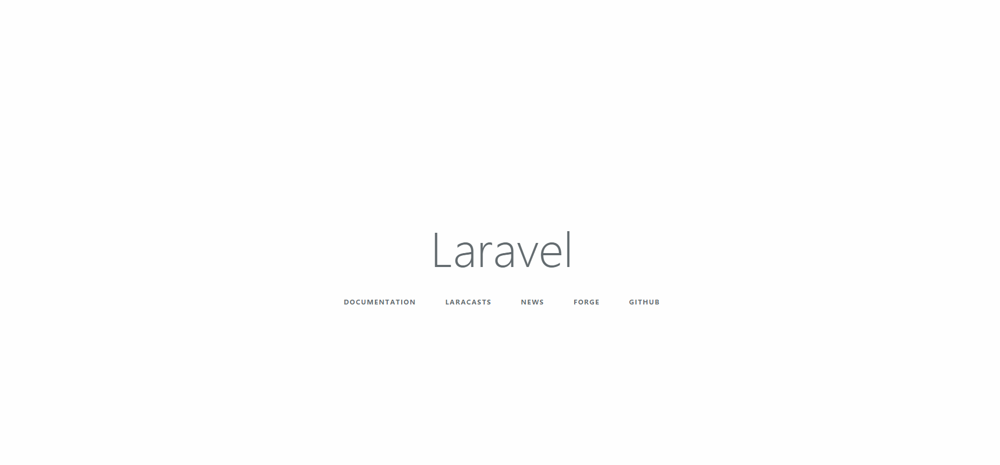

# Flash Message For Laravel5

[](https://travis-ci.org/GeekGhc/LaraFlash)

[](https://scrutinizer-ci.com/g/GeekGhc/LaraFlash/?branch=master)

[](https://scrutinizer-ci.com/g/GeekGhc/LaraFlash/build-status/master)

## 介绍
> 基于 [Jeffery Way's Flash Package](https://github.com/laracasts/flash)

## 预览


## 安装
#### 使用`composer`安装
```
composer require geekghc/flash
```
或者在你的`composer.json`里`require`部分添加
```php
"geekghc/flash":"~2.0"
```
#### 下载完毕之后在```config/app.php```添加`service provider`
```php
'providers' => [
    GeekGhc\LaraFlash\MyFlashProvider::class,
];
```
为了方便使用 可以再去添加一个`alias`
```php
'aliases' => [
    'LaraFlash'=>GeekGhc\LaraFlash\Flash::class,
];
```

## 用法
### 在你的控制器里 重定向之前
```php
public function store()
{
    LaraFlash::success("Welcome Aboard!");

    return Redirect::home();
}
```
#### 在你的视图中添加```notification```视图
```php
@include('laraflash::notification')
```
或者
```php
@include('laraflash::header-notification')
```

#### 你也可以按需求使用下面这种形式
- LaraFlash::success('Message')
- LaraFlash::info('Message')
- LaraFlash::error('Message')
- LaraFlash::warning('Message')

#### 当然你可也以使用```laraflash()```这样的`helper function`
- laraflash('Message!')
- laraflash()->success('Message!')
- laraflash()->info('Message!')
- laraflash()->error('Message!')
- laraflash()->warning('Message!')

## 例子
在此之前使用`CDN`的形式引入`jquery`和`font-awesome`
```html
<!DOCTYPE html>
<html>
<head>
    <meta charset="utf-8">
    <meta name="viewport" content="width=device-width, initial-scale=1">
    <title>Laravel</title>
    <link href="//cdn.bootcss.com/font-awesome/4.7.0/css/font-awesome.min.css" rel="stylesheet">
</head>
<body>
<script src="//cdn.bootcss.com/jquery/2.1.0/jquery.min.js"></script>
@include('laraflash::notification')
</body>
</html>
```

## 自定义样式
#### 你可以修改样式以达到你的需求
```
php artisan vendor:publish
```
##### 这样一来视图文件会放在你的```resources/views/vendor/laraFlash```目录下